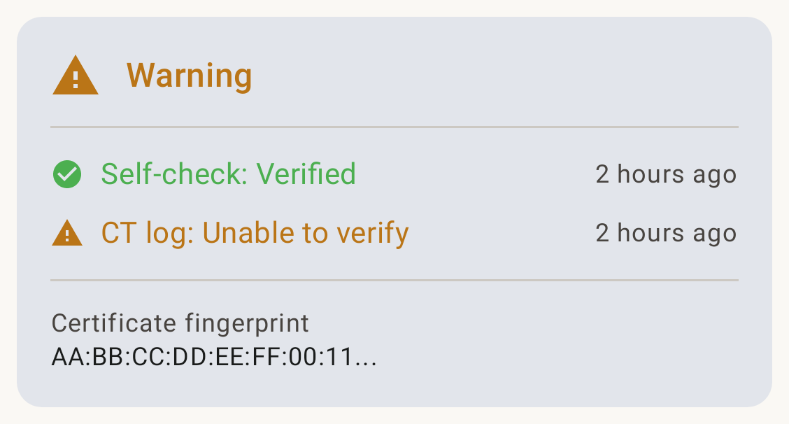
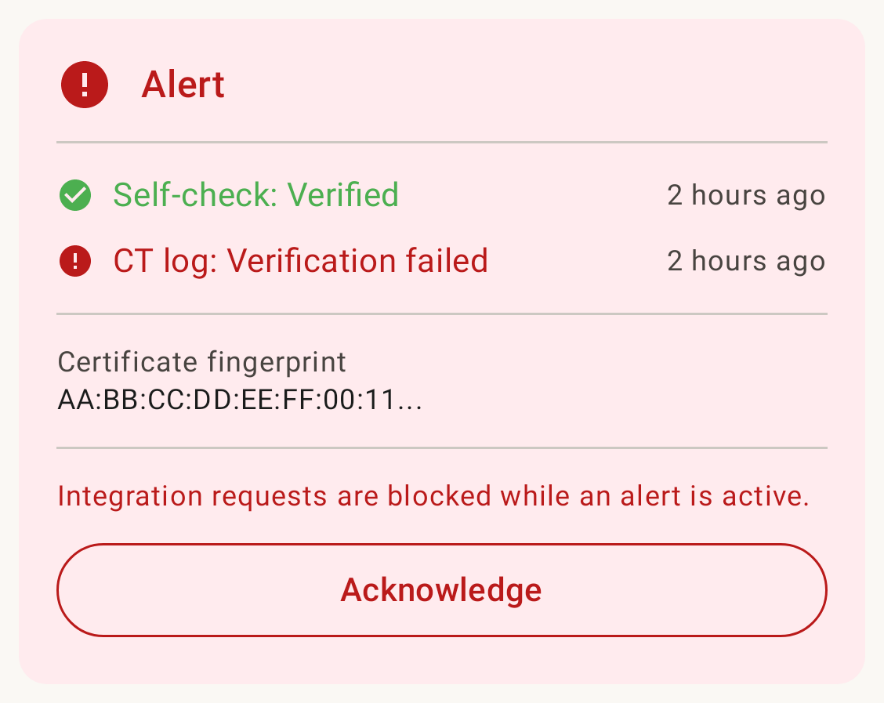
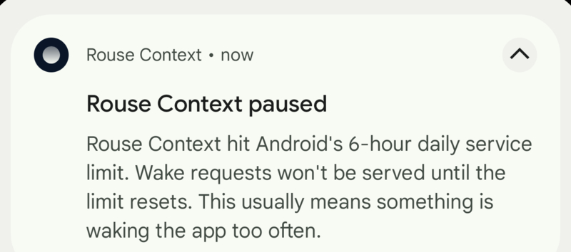

# Security

This page explains what the app's security alerts mean, how the encryption works at a high level, and what to do if something looks wrong.

## The short version

Your phone is the real server. The relay in the middle forwards encrypted bytes without being able to read them. AI clients have to be approved on your phone before they can call any tools. Every call is logged locally so you can see exactly what was asked.

## What gets encrypted

When an AI client connects, two layers of encryption are set up:

- **Client to phone** — end-to-end TLS, the same kind of encryption your browser uses for a bank website. Your phone holds the private key in its hardware-backed keystore, which means the key never leaves the secure element on the device.
- **Phone to relay** — a second, separate TLS connection that the relay uses to know which phone to forward traffic to.

The relay server cannot decrypt the client-to-phone stream. It sees that a connection exists, but not what is said over it.

## Security alerts in the app

The app runs background checks every few hours. If something looks wrong, you will see a **Security Alert** notification. The Settings screen also surfaces the current status as a card:

An amber **Warning** means a check is temporarily inconclusive (e.g. the CT log lookup timed out). It usually clears on the next cycle.

A red **Alert** means a check actively failed. Integration requests are blocked until you investigate and press **Acknowledge**.

Here is what the common ones mean.

### "Certificate mismatch detected"

**What it means:** The app connected to its own address and got back a TLS certificate that is not the one your phone provisioned. This could be a relay server compromise, a network-level attacker trying to impersonate your device, or — more often — a stale cache during the 90-day cert renewal window.

**What to do:** Open the app, check the Settings screen. If the alert persists for more than a few hours, rotate your subdomain (Settings → Rotate address). Email `security@rousecontext.com` if it keeps happening.

### "Unexpected certificate in public logs"

**What it means:** Every certificate issued by a publicly trusted certificate authority is recorded in a public ledger called Certificate Transparency. The app checks that ledger for your subdomain and will alert if a certificate appears that the app did not request itself.

**What to do:** This is the one to take seriously. A fraudulent cert in the CT log could mean a CA was tricked into issuing a cert for your hostname. Email `security@rousecontext.com` (or open a GitHub issue if it isn't sensitive) so we can help you rotate and investigate.

### "Foreground service limit reached"

**What it means:** Android restricts how long an app can run a foreground service. Every few hours the wake-up cycle needs a short foreground service, and occasionally Android refuses to start it. Usually transient.

**What to do:** Tap the notification to dismiss it. If you see it repeatedly, see [Troubleshooting](troubleshooting.md).

## What the app cannot protect against

Be honest with yourself about this:

- **What the AI client does with data after it gets it.** We have no say over that. Read your AI provider's policy.
- **An attacker with physical access to an unlocked phone.** Standard Android device security applies.
- **A compromised AI client.** If you approve ChatGPT and ChatGPT is compromised, the attacker has whatever ChatGPT was allowed to call.

Everything else — network snoopers, the relay operator, the FCM push service — can see metadata at best, not your data.

## See also

- [Privacy](privacy.md) — what data leaves the phone.
- [FAQ](faq.md) — "can you read my data?" and similar.
